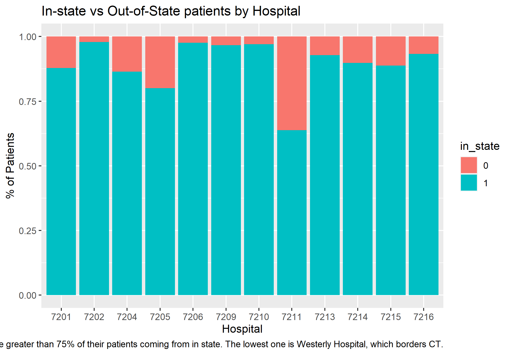

```{r setup, include=FALSE}
knitr::opts_chunk$set(echo = FALSE)
```


## Age and Cost by Sex


{width=70%}


## Length of Stay vs Cost


{width=70%}


## Provider Admissions


{width=70%}

## Costs of Top Three Hospitals


{width=70%}

## Percent of In State Patients


{width=70%}

## Cost and Gender by Hospital


{width=70%}

## Admission Type


{width=70%}

## Rhode Island Hospital Payers


{width=70%}

## Length of Stay and Hospital


{width=70%}

## ER Admissions at Rhode Island Hospital


{width=70%}

## Month-by-Month Admissions


## Cost Variable Importance


## Cost Tree K-Folds


## Cost Model Comparison


## Gender Variable Importance


## Gender Tree K-Folds


## Gender Model


